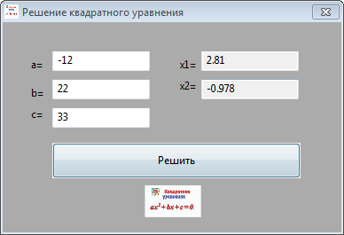
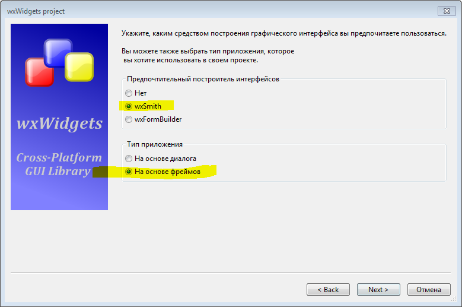
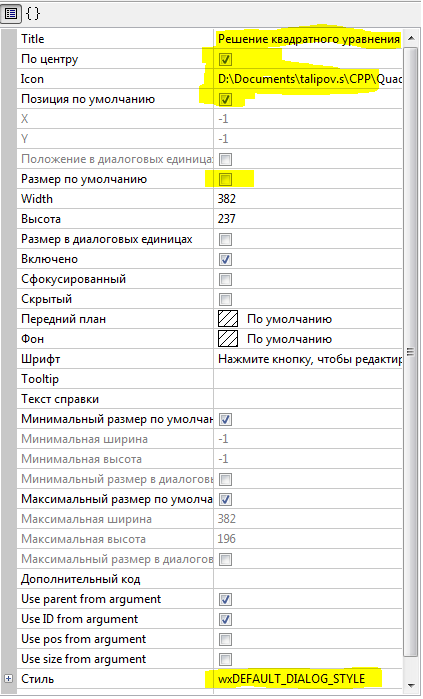
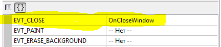
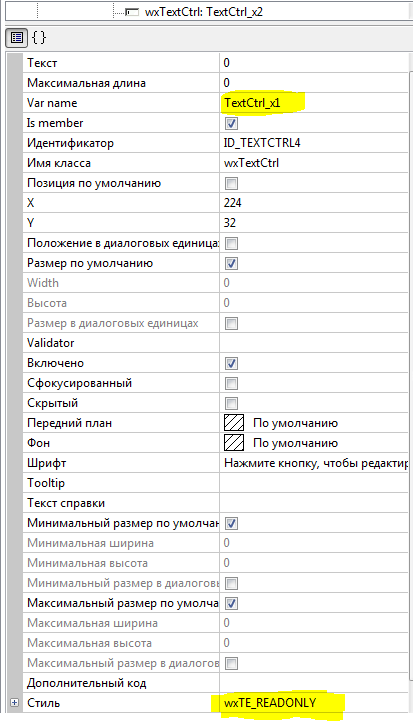

# Quadratic_equation_wxwidgets
Пример решения квадратного уравнения на С++ в Code::Blocks с использованием wxWidgets











```
#include <cmath>

using namespace std;

// Решение квадратного уравнения
void Quadratic_equation_wxwidgetsFrame::OnButton_CalcClick(wxCommandEvent& event)
{
    try {
        double a = strtod(TextCtrl_a->GetValue(), NULL);
        double b = strtod(TextCtrl_b->GetValue(), NULL);
        double c = strtod(TextCtrl_c->GetValue(), NULL);
        double d, x1, x2;
        d = b*b - 4*a*c;
        x1 = (-b-sqrt(d))/(2*a);
        x2 = (-b+sqrt(d))/(2*a);
        if (isnan(x1) || isnan(x2) || isinf(x1) || isinf(x2)) { throw logic_error(""); }
        TextCtrl_x1->SetValue(wxString::Format(wxT("%.3f"),x1));
        TextCtrl_x2->SetValue(wxString::Format(wxT("%.3f"),x2));
    } catch (...) {
        TextCtrl_x1->SetValue("???");
        TextCtrl_x2->SetValue("???");
    }
}

```
